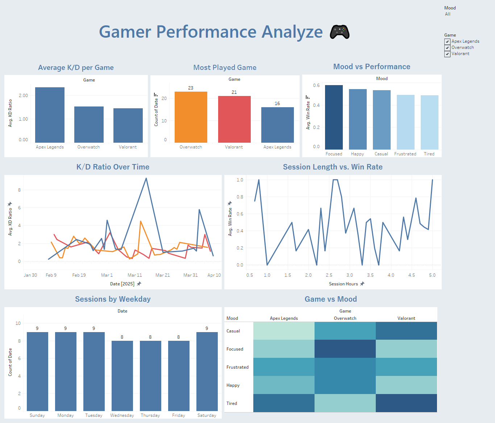

# 🎮 Gamer Performance Analyzer
**By Zuhayr Chowdhury**

This project analyzes 60 days of gameplay session data to answer:  
> "Am I improving through skill — or just grinding more hours?"

## 🛠️ Tools Used
- **Python** (data simulation)
- **SQLite + SQL** (data modeling & querying)
- **Tableau** (data visualization & dashboard design)

## 📈 Key Insights
- Apex Legends had the **highest K/D ratio** (2.34)
- Best win rates occurred during **focused mood** (~60%)
- Longer sessions didn’t always lead to better performance
- Overwatch was **most played** but not most efficient

## 📊 Dashboard Preview

📌 [View Full Dashboard on Tableau Public](https://your-tableau-link.com)

## 📁 Files Included
- `/data`: Generated CSVs
- `/notebooks`: All Python code (data + SQL)
- `/images`: Screenshots of dashboard
- `/dashboard`: Final exported dashboard (PDF or TWBX)

## 💡 What I Learned
- How to simulate realistic datasets using Python
- How to use SQL to explore behavior and performance patterns
- How to build a clean, insightful Tableau dashboard with strong storytelling

---
